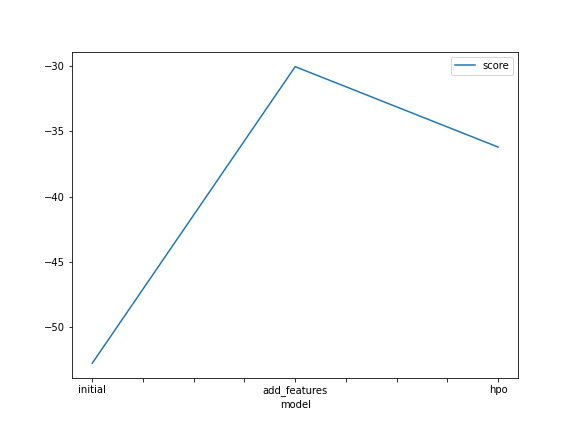

# Report: Predict Bike Sharing Demand with AutoGluon Solution
#### NAME HERE

## Initial Training
### What did you realize when you tried to submit your predictions? What changes were needed to the output of the predictor to submit your results?
At the start of the execution without any data analysis or feature engineering, the model did not perform well. Th submission score was low. Data Engineering was needed to remove negative values and to include more features out of the given data.

### What was the top ranked model that performed?
WeightedEnsemble_L3 with created features performed well.

## Exploratory data analysis and feature creation
### What did the exploratory analysis find and how did you add additional features?
For the extra features I divided the datetime in month, day, year and hour. Also it was usefull to transform the season and weather features to categorical

### How much better did your model preform after adding additional features and why do you think that is?
Additional features can be good predictors to estimate the target value, in this case I decided to separate the date becuase it helps the model to analyse the patterns in the data which can be usefull for a regression model

## Hyper parameter tuning
### How much better did your model preform after trying different hyper parameters?
The score downgraded a bit, but looks like I need to tune it further to get the best result out of it. This was the first attempt in tuning the model.

### If you were given more time with this dataset, where do you think you would spend more time?
I would explore hyperparameters more in depth.

### Create a table with the models you ran, the hyperparameters modified, and the kaggle score.

model	hpo1	hpo2	hpo3	score
0	initial_model	default_vals	default_vals	default_vals	1.80186
1	add_features_model	default_vals	default_vals	default_vals	0.68635
2	hpo_model	GBM: num_leaves: lower=26, upper=66	NN: dropout_prob: 0.0, 0.5	GBM: num_boost_round: 100	0.47483

### Create a line plot showing the top model score for the three (or more) training runs during the project.
Please look into the image saved at below path as i do not know how to insert here.

### Create a line plot showing the top kaggle score for the three (or more) prediction submissions during the project.

Please look into the image saved at below path

## Summary
In this project I applied all the concepts that were covered in the unit like Model Workflow, feature engineering, the algorithms and tools etc. Using these skills I was able to develop a machine learning model by using the autogluon framework, at the end the results were good because the kaggle score of my model was close to the professional developers with years of experience. Also I would further tune the hyperparameters to get the best results.
